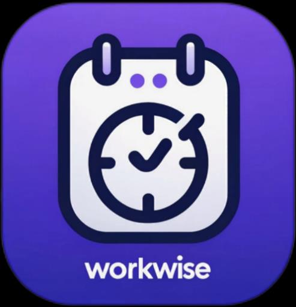
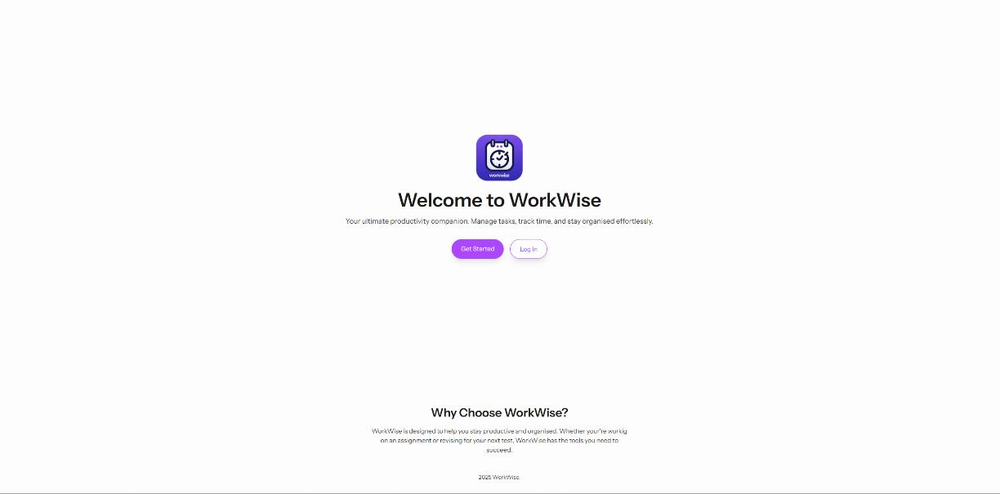
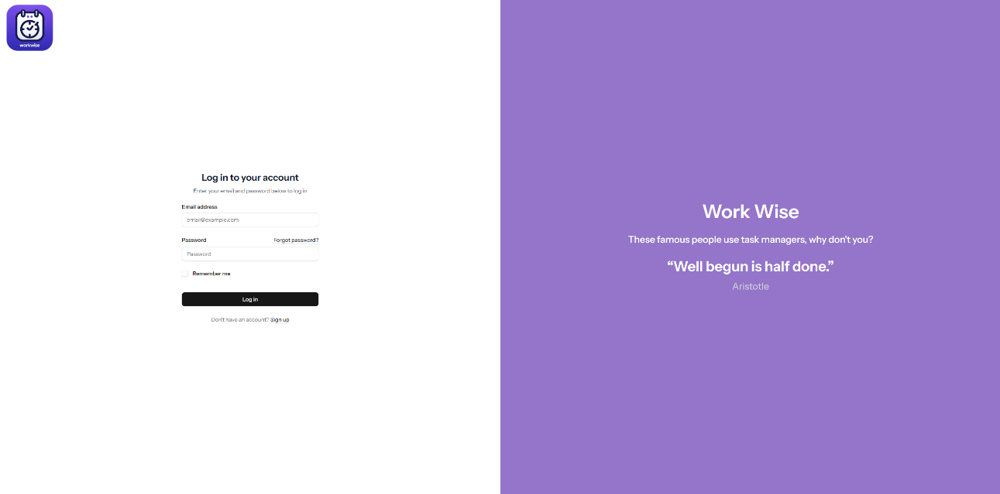
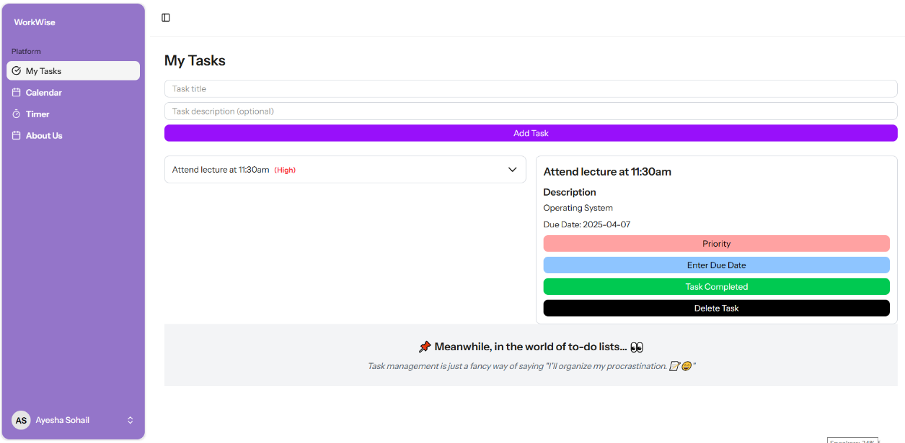
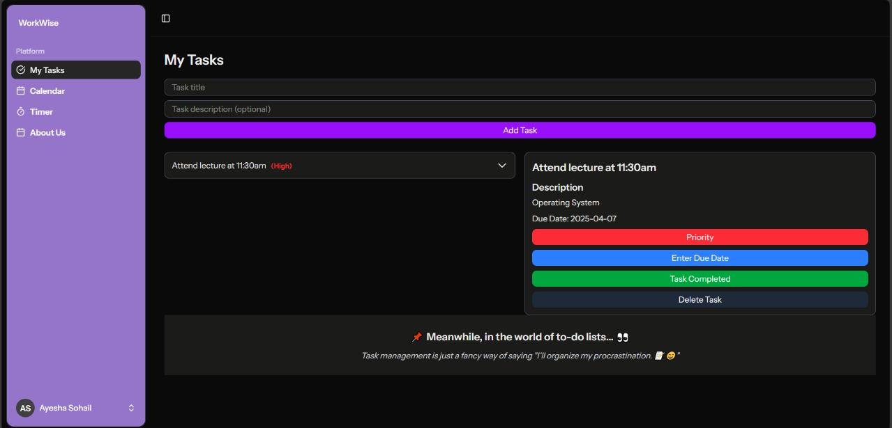
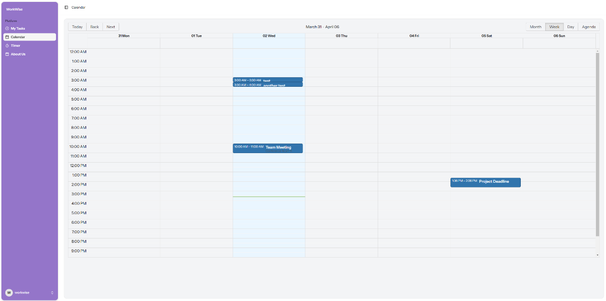
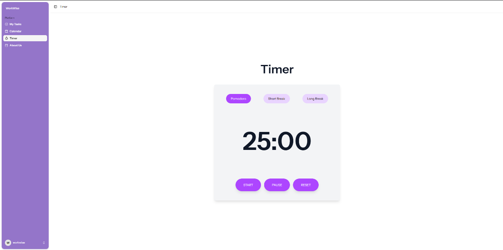
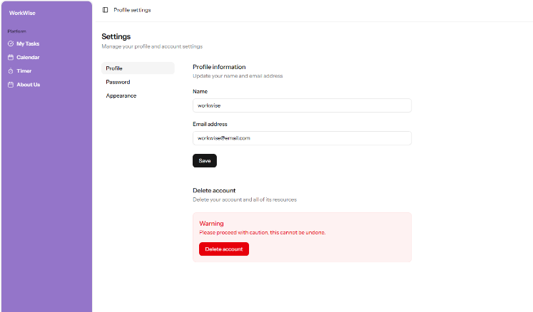

<p align="center">
  
</p>

<h1 align="center">WorkWise</h1>

<p align="center">
  A full-stack productivity web app that helps university students manage tasks, deadlines and study time in one place.
</p>

<p align="center">
  
  
  
  
  
</p>

---

## About the Project

Students juggle lectures, assignments, revision and part-time work, and often feel overwhelmed. Research into existing tools such as Trello, together with conversations with students on campus, showed that most task managers ignore **wellbeing and focus**. WorkWise combines task management, a calendar and a **Pomodoro study timer** in a simple interface built for students.

**My role:** Team Lead and Full-Stack Developer. I led planning (Scrum sprints, Trello board, team meetings), wrote the majority of the codebase across the front end and back end, and authored the project report.

> Built for the Team Project module (CII2350), University of Huddersfield, 2025.

---

## Features

- **Authentication:** secure registration, login and password reset, with hashed passwords and CSRF protection
- **My Tasks:** create, view, complete and delete tasks, with descriptions, due dates and priority levels (High / Medium / Low)
- **Calendar:** add and delete events, with month, week, day and agenda views to spot busy days and upcoming deadlines
- **Pomodoro Timer:** 25-minute focus sessions with short and long breaks, plus start, pause and reset controls
- **Settings:** update profile and password, delete account, and switch between **light, dark and system** themes
- **Motivational touches:** inspirational quotes on the login and register pages

---

## Screenshots

| Welcome | Login |
|---|---|
|  |  |

| My Tasks | My Tasks (Dark Mode) |
|---|---|
|  |  |

| Calendar | Pomodoro Timer |
|---|---|
|  |  |

| Settings |
|---|
|  |

---

## Tech Stack

| Layer | Technology |
|---|---|
| Back end | Laravel 12 (PHP 8.4), MVC architecture, Eloquent ORM |
| Front end | React with TypeScript, Inertia.js |
| Styling | Tailwind CSS |
| Database | MySQL (managed with XAMPP and phpMyAdmin) |
| Tools | Git and GitHub, VS Code, Trello, Microsoft Teams |

**Why Inertia.js?** It connects Laravel directly to React pages, giving a single-page app experience without building a separate REST API.

---

## Development Process

- **Agile / Scrum:** work was split by page and feature, with sprint reviews to test and refine code
- **Planning:** requirement analysis, competitor research and wireframes before development
- **Version control:** Git and GitHub with regular commits
- **Testing:** functional testing of every core feature, including login and registration, invalid credentials, password hashing, task and calendar create/delete, timer controls, profile updates, dark mode and account deletion. All tests passed.

### Challenges and Learnings
Setting up Laravel across different machines took longer than planned, which limited time for extra features such as Google Calendar and AI integrations. The main lesson: set up the development environment early and agree on it as a team before feature work begins.

---

## Getting Started

**Requirements:** PHP 8.2+, Composer, Node.js and npm, MySQL (e.g. via XAMPP)

```bash
# 1. Clone the repository
git clone https://github.com/ayesha112244/workwise-task-manager.git
cd workwise-task-manager/workwise-website

# 2. Install dependencies
composer install
npm install

# 3. Set up the environment file
cp .env.example .env
php artisan key:generate
```

4. Create a MySQL database (e.g. `workwise_db`) and update the `DB_` settings in `.env`.

```bash
# 5. Run migrations
php artisan migrate

# 6. Start the app (two terminals)
php artisan serve
npm run dev
```

Then open **http://localhost:8000**.

> The `.env` file and `vendor/` folder are not included in the repository for security reasons, which is why steps 2–3 are needed.

---

## Future Improvements

- Google Calendar sync
- AI-powered study suggestions
- Pomodoro session history and productivity insights
- Deadline notifications
- Mobile app version

---

**Author:** Ayesha Sohail · [GitHub](https://github.com/ayesha112244)
